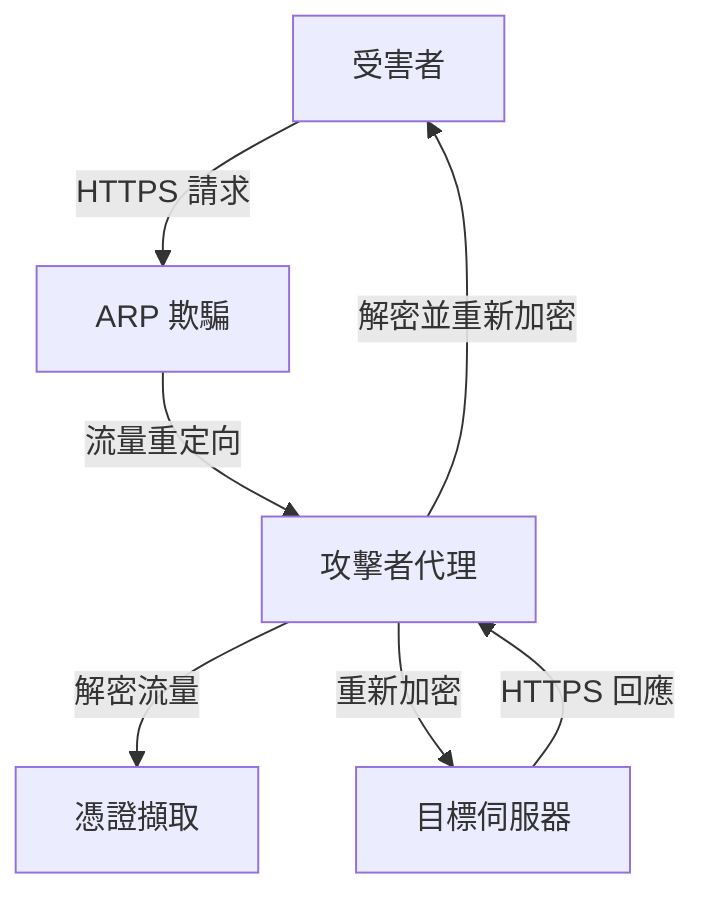

# TLS Connection Hijacking - Documentation Index

## 專案概述 (Project Overview)

This project demonstrates a comprehensive **Man-in-the-Middle (MITM) attack** on TLS/HTTPS connections. The implementation includes ARP spoofing, traffic redirection, SSL/TLS proxy functionality, and credential extraction capabilities.

## 文檔結構 (Documentation Structure)

### 1. 主要文檔 (Main Documentation)
- **[README_DOCUMENTATION.md](./README_DOCUMENTATION.md)** - 專案概述和基本使用說明
- **[SCRIPT_ANALYSIS.md](./SCRIPT_ANALYSIS.md)** - 腳本詳細分析和技術實現
- **[SECURITY_ANALYSIS.md](./SECURITY_ANALYSIS.md)** - 安全威脅分析和防護措施

### 2. 原始檔案 (Original Files)
- **[attack.py](./attack.py)** - 主要的 MITM 攻擊程式
- **[setup.sh](./setup.sh)** - 攻擊者環境設定腳本
- **[victim_setup.sh](./victim_setup.sh)** - 受害者環境設定腳本
- **[arpspoof.sh](./arpspoof.sh)** - ARP 欺騙執行腳本
- **[readme.md](./readme.md)** - 基本使用說明

## 快速開始 (Quick Start)

### 攻擊者設定
```bash
# 1. 執行環境設定
sudo ./setup.sh

# 2. 在兩個終端中執行 ARP 欺騙
sudo ./arpspoof.sh

# 3. 啟動攻擊程式
sudo python3 ./attack.py <victim_ip>
```

### 受害者設定
```bash
# 使用忽略證書錯誤的瀏覽器
./victim_setup.sh
```

## 技術架構 (Technical Architecture)

### 攻擊流程


### 核心組件
1. **ARP Spoofing Module** - ARP 欺騙模組
2. **Traffic Redirection** - 流量重定向
3. **SSL/TLS Proxy** - SSL/TLS 代理
4. **Credential Extraction** - 憑證擷取
5. **Certificate Management** - 證書管理

## 安全考量 (Security Considerations)

### ⚠️ 重要警告 (Important Warning)
此專案僅供教育和研究目的使用。未經授權的網路攻擊是違法行為。

### 合法使用場景
- 網路安全教育和研究
- 授權的滲透測試
- 自己的網路環境測試
- 安全產品開發和測試

### 防護措施
1. **證書釘選** - 防止自簽名證書攻擊
2. **HSTS** - 強制使用 HTTPS
3. **網路分段** - 限制攻擊範圍
4. **入侵檢測** - 即時檢測攻擊
5. **用戶教育** - 提高安全意識

## 學習目標 (Learning Objectives)

通過此專案，您將學習到：

### 1. 網路安全概念
- ARP 欺騙攻擊原理
- 中間人攻擊技術
- SSL/TLS 安全機制
- 網路流量分析

### 2. 程式設計技能
- Python 網路程式設計
- SSL/TLS 程式設計
- 多執行緒程式設計
- 正則表達式應用

### 3. 系統管理技能
- Linux 網路配置
- iptables 規則設定
- ARP 表管理
- 系統監控

### 4. 安全分析技能
- 威脅建模
- 風險評估
- 防護機制設計
- 事件回應

## 進階主題 (Advanced Topics)

### 1. 進階攻擊技術
- DNS 欺騙攻擊
- DHCP 欺騙攻擊
- 802.1X 繞過
- 證書鏈攻擊

### 2. 進階防護技術
- 證書透明度 (Certificate Transparency)
- DNS over HTTPS (DoH)
- 網路分段技術
- 零信任架構

### 3. 檢測和回應
- 機器學習檢測
- 行為分析
- 自動化回應
- 威脅情報整合

## 相關資源 (Related Resources)

### 1. 技術文檔
- [RFC 5246 - TLS 1.2](https://tools.ietf.org/html/rfc5246)
- [RFC 8446 - TLS 1.3](https://tools.ietf.org/html/rfc8446)
- [OWASP Top 10](https://owasp.org/www-project-top-ten/)
- [NIST Cybersecurity Framework](https://www.nist.gov/cyberframework)

### 2. 工具和框架
- [Scapy](https://scapy.net/) - Python 網路封包操作
- [Wireshark](https://www.wireshark.org/) - 網路協定分析器
- [Metasploit](https://www.metasploit.com/) - 滲透測試框架
- [Nmap](https://nmap.org/) - 網路掃描工具

### 3. 學習資源
- [Cybrary](https://www.cybrary.it/) - 網路安全課程
- [SANS](https://www.sans.org/) - 安全培訓和認證
- [Coursera](https://www.coursera.org/) - 線上課程
- [edX](https://www.edx.org/) - 大學課程

## 貢獻指南 (Contributing Guidelines)

### 1. 代碼貢獻
- 遵循 Python PEP 8 風格指南
- 添加適當的註釋和文檔
- 包含錯誤處理和日誌記錄
- 進行充分的測試

### 2. 文檔貢獻
- 使用清晰的英文和繁體中文
- 提供代碼範例和圖表
- 保持文檔的準確性和時效性
- 遵循 Markdown 格式規範

### 3. 安全考量
- 確保所有貢獻都是合法的
- 不包含惡意代碼或內容
- 遵循負責任的披露原則
- 考慮安全影響

## 版本歷史 (Version History)

### v1.0.0 (2025-01-XX)
- 初始版本發布
- 基本的 MITM 攻擊功能
- ARP 欺騙和流量重定向
- SSL/TLS 代理實現
- 憑證擷取功能

## 授權條款 (License)

此專案僅供教育和研究目的使用。使用者必須：

1. 獲得所有必要的授權
2. 遵守當地法律法規
3. 只用於合法目的
4. 承擔所有相關責任

## 聯絡資訊 (Contact Information)

如有問題或建議，請通過以下方式聯絡：

- **專案維護者**: [Your Name]
- **電子郵件**: [your.email@example.com]
- **GitHub**: [your-github-username]
- **LinkedIn**: [your-linkedin-profile]

## 免責聲明 (Disclaimer)

本專案僅供教育和研究目的使用。作者不對任何因使用本專案而造成的損害負責。使用者必須：

1. 確保合法使用
2. 獲得適當授權
3. 遵守相關法律
4. 承擔所有責任

使用本專案即表示您同意上述條款。

---

**最後更新**: 2025年1月
**版本**: 1.0.0
**狀態**: 穩定版本
