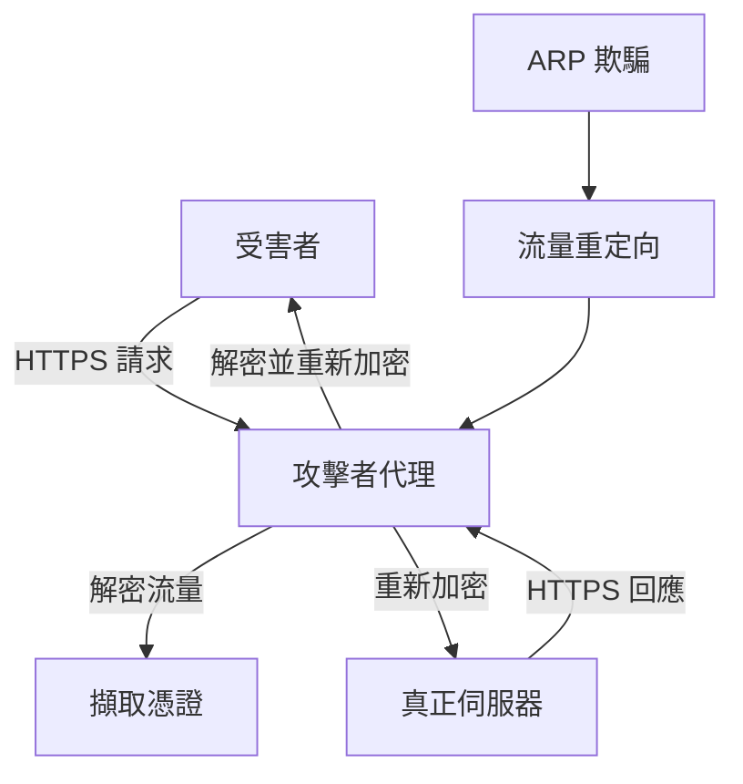

# TLS Connection Hijacking - CSC Homework 1

## 專案概述 (Project Overview)

This project demonstrates a **Man-in-the-Middle (MITM) attack** on TLS/HTTPS connections. The attack intercepts encrypted HTTPS traffic by acting as a proxy between the victim and the legitimate server, allowing the attacker to decrypt and inspect the traffic while maintaining the appearance of a secure connection to the victim.

## 攻擊原理 (Attack Methodology)

### 1. ARP Spoofing (ARP 欺騙)
- 使用 `arpspoof` 工具進行 ARP 欺騙
- 欺騙受害者的 ARP 表，讓受害者認為攻擊者是網關
- 欺騙網關的 ARP 表，讓網關認為攻擊者是受害者

### 2. Traffic Redirection (流量重定向)
- 使用 iptables 規則將 HTTPS 流量 (port 443) 重定向到攻擊者的代理伺服器 (port 8080)
- 只針對特定 IP 範圍 (140.113.0.0-140.113.255.255) 進行重定向

### 3. SSL/TLS Proxy (SSL/TLS 代理)
- 攻擊者建立自己的 SSL 伺服器，使用自簽名證書
- 受害者與攻擊者建立 TLS 連接
- 攻擊者與真正的目標伺服器建立 TLS 連接
- 攻擊者可以解密和檢查所有流量

## 檔案結構 (File Structure)

```
csc_hw1/
├── attack.py              # 主要的 MITM 攻擊程式
├── setup.sh              # 攻擊者環境設定腳本
├── victim_setup.sh       # 受害者環境設定腳本
├── arpspoof.sh          # ARP 欺騙執行腳本
├── certificates/         # SSL 證書目錄
│   ├── host.crt         # 自簽名證書
│   └── host.key         # 私鑰
└── readme.md            # 基本使用說明
```

## 程式碼分析 (Code Analysis)

### attack.py 主要功能

#### 1. 網路介面偵測
```python
def get_interface_name():
    # 自動偵測可用的網路介面 (排除 lo)
    # 返回第一個非 loopback 介面
```

#### 2. 憑證資訊擷取
```python
def extract_info(request):
    # 使用正則表達式從 HTTP 請求中擷取登入憑證
    # 解析 id 和 pwd 參數
    # 進行 URL 解碼
```

#### 3. MITM 代理功能
```python
def mitm_proxy(client_socket, victim_ip):
    # 接收受害者的 HTTPS 請求
    # 擷取登入憑證
    # 解析目標主機
    # 建立與真正伺服器的 TLS 連接
    # 轉發請求和回應
```

#### 4. HTTPS 監聽器
```python
def start_https_listener(interface):
    # 建立 TCP 伺服器監聽 port 8080
    # 使用 SSL 包裝伺服器
    # 為每個連接啟動新的執行緒
```

## 使用方式 (Usage Instructions)

### 攻擊者設定 (Attacker Setup)

1. **啟用 IP 轉發**
```bash
sudo sysctl -w net.ipv4.ip_forward=1
```

2. **設定 iptables 規則**
```bash
sudo iptables -t nat -F
sudo iptables -t nat -A PREROUTING -p tcp --dport 443 -m iprange --dst-range 140.113.0.0-140.113.255.255 -j REDIRECT --to-port 8080
```

3. **執行 ARP 欺騙**
```bash
# 在兩個終端中分別執行
sudo arpspoof -i ens33 -t 192.168.2.2 192.168.2.133
sudo arpspoof -i ens33 -t 192.168.2.133 192.168.2.2
```

4. **啟動攻擊程式**
```bash
sudo python3 ./attack.py <victim_ip> [interface]
```

### 受害者設定 (Victim Setup)

1. **使用忽略證書錯誤的瀏覽器**
```bash
google-chrome --ignore-certificate-errors --user-data-dir=/tmp/chrome_dev
```

2. **訪問目標網站並進行登入**

## 攻擊流程 (Attack Flow)



## 技術細節 (Technical Details)

### SSL/TLS 處理
- 使用 Python 的 `ssl` 模組建立 TLS 連接
- 自簽名證書用於與受害者建立連接
- 預設 SSL 上下文用於與目標伺服器建立連接

### 網路配置
- 監聽所有介面 (0.0.0.0:8080)
- 支援多執行緒處理多個連接
- 設定適當的 socket timeout

### 憑證擷取
- 使用正則表達式解析 HTTP 請求
- 支援 URL 編碼的參數
- 即時顯示擷取的憑證

## 安全影響 (Security Implications)

### 攻擊成功條件
1. 攻擊者與受害者在同一網段
2. 受害者忽略 SSL 證書警告
3. 攻擊者能夠執行 ARP 欺騙

### 防護措施 (Countermeasures)

1. **證書釘選 (Certificate Pinning)**
   - 在應用程式中硬編碼證書指紋
   - 防止自簽名證書攻擊

2. **HSTS (HTTP Strict Transport Security)**
   - 強制使用 HTTPS
   - 防止降級攻擊

3. **網路監控**
   - 監控 ARP 表異常
   - 檢測重複的 MAC 地址

4. **用戶教育**
   - 不要忽略瀏覽器安全警告
   - 檢查證書有效性

## 法律聲明 (Legal Disclaimer)

⚠️ **重要警告**: 此程式僅供教育和研究目的使用。未經授權的網路攻擊是違法行為。使用者必須確保：

1. 只在自己的網路環境中測試
2. 獲得所有相關方的明確許可
3. 遵守當地法律法規
4. 不得用於惡意目的

## 環境需求 (Requirements)

- Python 3.x
- scapy
- iptables
- arpspoof
- SSL 證書 (自簽名)

## 故障排除 (Troubleshooting)

### 常見問題

1. **權限不足**
   - 確保以 root 權限執行
   - 檢查 iptables 規則是否正確設定

2. **網路介面問題**
   - 確認網路介面名稱正確
   - 檢查網路連接狀態

3. **證書問題**
   - 確保證書檔案存在且格式正確
   - 檢查證書路徑設定

4. **流量未重定向**
   - 驗證 iptables 規則
   - 檢查 ARP 欺騙是否成功

## 結論 (Conclusion)

此專案展示了 TLS 連接劫持的基本原理和實現方法。雖然攻擊技術本身很強大，但現代網路安全措施已經大大提高了防護能力。理解這些攻擊方法有助於：

1. 提高網路安全意識
2. 開發更好的防護機制
3. 進行有效的安全測試
4. 教育用戶安全最佳實踐

記住，知識本身是中性的，關鍵在於如何正確使用這些知識來保護而非破壞網路安全。
