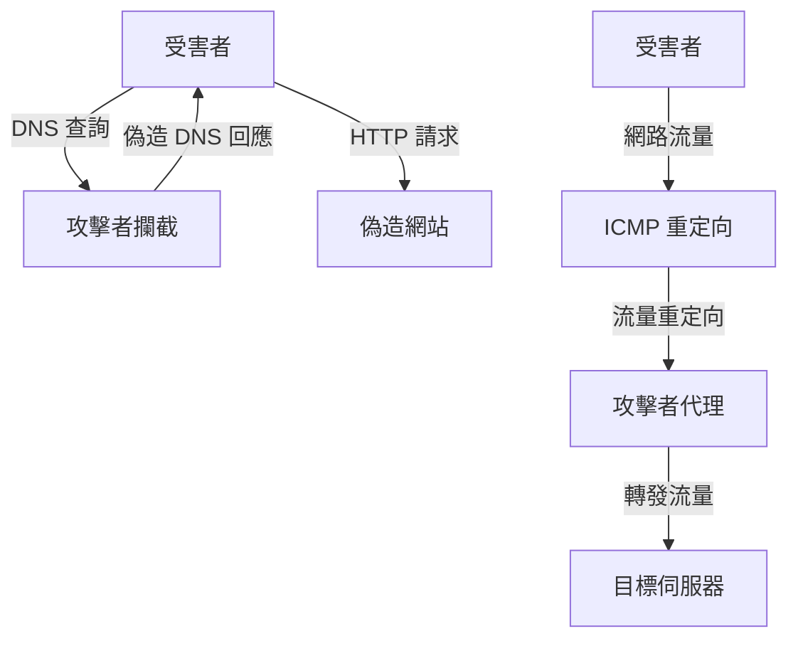

# MITM and Pharming Attacks in Wi-Fi Networks - Documentation Index

## 專案概述 (Project Overview)

This project demonstrates comprehensive **Man-in-the-Middle (MITM)** and **Pharming attacks** in Wi-Fi networks. The implementation includes DNS spoofing for pharming attacks and ICMP redirect for traffic redirection, showcasing advanced network security attack techniques.

## 文檔結構 (Documentation Structure)

### 1. 主要文檔 (Main Documentation)
- **[README_DOCUMENTATION.md](./README_DOCUMENTATION.md)** - 專案概述和基本使用說明
- **[ATTACK_METHODS_ANALYSIS.md](./ATTACK_METHODS_ANALYSIS.md)** - 攻擊方法詳細分析
- **[PHARMING_ATTACKS_ANALYSIS.md](./PHARMING_ATTACKS_ANALYSIS.md)** - Pharming 攻擊深度分析

### 2. 原始檔案 (Original Files)
- **[he110_pharm.cpp](./he110_pharm.cpp)** - DNS 欺騙攻擊程式
- **[icmp_redirect.cpp](./icmp_redirect.cpp)** - ICMP 重定向攻擊程式
- **[makefile](./makefile)** - 編譯設定檔
- **[victim_config.sh](./victim_config.sh)** - 受害者環境設定
- **[csc-project2-2025-v3.pdf](./csc-project2-2025-v3.pdf)** - 專案需求文件

## 快速開始 (Quick Start)

### 編譯和設定
```bash
# 編譯所有程式
make all

# 設定受害者環境
./victim_config.sh
```

### DNS Spoofing Attack
```bash
# 基本使用
sudo ./he110_pharm

# 指定網路介面
sudo ./he110_pharm <interface_name>
```

### ICMP Redirect Attack
```bash
# 指定目標 IP 和網路介面
sudo ./icmp_redirect <target_ip> <interface_name>
```

## 攻擊類型 (Attack Types)

### 1. DNS Spoofing Attack (DNS 欺騙攻擊)
- **目標**: 將合法域名解析重定向到惡意 IP 地址
- **實現**: `he110_pharm.cpp`
- **影響**: 用戶訪問偽造的網站

### 2. ICMP Redirect Attack (ICMP 重定向攻擊)
- **目標**: 重定向受害者的網路流量
- **實現**: `icmp_redirect.cpp`
- **影響**: 流量被重定向到攻擊者

## 技術架構 (Technical Architecture)

### 攻擊流程


### 核心組件
1. **DNS Spoofing Module** - DNS 欺騙模組
2. **ICMP Redirect Module** - ICMP 重定向模組
3. **Network Discovery** - 網路發現功能
4. **Packet Construction** - 封包構造功能
5. **Traffic Interception** - 流量攔截功能

## 攻擊方法分析 (Attack Methods Analysis)

### DNS Spoofing 技術
- **封包攔截**: 使用 Tins 庫監聽網路流量
- **DNS 解析**: 解析 DNS 查詢封包
- **回應偽造**: 建立包含偽造 A 記錄的 DNS 回應
- **封包重組**: 重建完整的網路封包

### ICMP Redirect 技術
- **網路掃描**: 使用 ping 掃描網段內所有 IP
- **ARP 表解析**: 從 `/proc/net/arp` 讀取 ARP 表
- **ICMP 封包構造**: 建立符合 RFC 792 的 ICMP 重定向封包
- **封包發送**: 使用原始 socket 發送封包

## Pharming 攻擊分析 (Pharming Attack Analysis)

### 攻擊類型
1. **DNS Cache Poisoning** - DNS 快取投毒
2. **DNS Spoofing** - DNS 欺騙
3. **Hosts File Modification** - Hosts 檔案修改
4. **Router-based Pharming** - 路由器 Pharming

### 攻擊影響
- **憑證竊取**: 偽造網站可能竊取用戶憑證
- **惡意軟體**: 可能下載惡意軟體
- **資料洩露**: 敏感資料可能被竊取
- **品牌損害**: 組織的聲譽受損

## 防護機制 (Defense Mechanisms)

### DNS Spoofing 防護
1. **DNSSEC** - DNS 安全擴展
2. **DNS over HTTPS (DoH)** - 加密 DNS 查詢
3. **DNS over TLS (DoT)** - TLS 加密 DNS
4. **本地 DNS 快取** - 使用可信的本地 DNS 伺服器

### ICMP Redirect 防護
1. **禁用重定向** - 在系統中禁用 ICMP 重定向接受
2. **靜態路由** - 使用靜態路由表防止重定向
3. **網路監控** - 監控異常的 ICMP 重定向封包
4. **防火牆規則** - 阻擋可疑的 ICMP 重定向封包

### 一般防護措施
1. **網路分段** - 使用 VLAN 隔離網路
2. **入侵檢測** - 部署 IDS/IPS 系統
3. **流量監控** - 監控異常的網路流量
4. **用戶教育** - 教育用戶識別可疑的網路行為

## 檢測和回應 (Detection and Response)

### 檢測方法
1. **DNS 監控** - 監控 DNS 查詢和回應
2. **ICMP 監控** - 監控 ICMP 重定向封包
3. **路由表監控** - 監控路由表變化
4. **流量分析** - 分析異常的網路流量模式

### 回應措施
1. **立即回應** - 清除 DNS 快取、重啟服務
2. **長期回應** - 更新 DNS 設定、啟用 DNSSEC
3. **系統修復** - 修復被攻擊的系統
4. **安全加固** - 加強安全防護措施

## 法律和道德考量 (Legal and Ethical Considerations)

### 合法使用場景
- 網路安全教育和研究
- 授權的滲透測試
- 自己的網路環境測試
- 安全產品開發和測試

### 非法使用場景
- 未經授權的網路攻擊
- 竊取他人憑證
- 商業間諜活動
- 任何惡意目的

### 責任聲明
使用者必須確保：
1. 獲得所有必要的授權
2. 遵守當地法律法規
3. 只用於合法目的
4. 承擔所有相關責任

## 學習目標 (Learning Objectives)

通過此專案，您將學習到：

### 1. 網路安全概念
- DNS 協定安全機制
- ICMP 重定向攻擊原理
- Pharming 攻擊技術
- 網路流量分析

### 2. 程式設計技能
- C++ 網路程式設計
- 封包操作和構造
- 多執行緒程式設計
- 系統程式設計

### 3. 系統管理技能
- Linux 網路配置
- ARP 表管理
- 路由表操作
- 系統監控

### 4. 安全分析技能
- 威脅建模
- 風險評估
- 防護機制設計
- 事件回應

## 進階主題 (Advanced Topics)

### 1. 進階攻擊技術
- DNS 快取投毒
- 路由器攻擊
- 無線網路攻擊
- 進階中間人攻擊

### 2. 進階防護技術
- 證書透明度 (Certificate Transparency)
- 網路分段技術
- 零信任架構
- 機器學習檢測

### 3. 檢測和回應
- 行為分析
- 自動化回應
- 威脅情報整合
- 事件回應流程

## 相關資源 (Related Resources)

### 1. 技術文檔
- [RFC 1035 - DNS Specification](https://tools.ietf.org/html/rfc1035)
- [RFC 792 - ICMP Protocol](https://tools.ietf.org/html/rfc792)
- [RFC 4033 - DNSSEC](https://tools.ietf.org/html/rfc4033)
- [OWASP Top 10](https://owasp.org/www-project-top-ten/)

### 2. 工具和框架
- [Tins](https://github.com/mfontanini/libtins) - C++ 網路封包操作庫
- [Wireshark](https://www.wireshark.org/) - 網路協定分析器
- [Nmap](https://nmap.org/) - 網路掃描工具
- [tcpdump](https://www.tcpdump.org/) - 封包擷取工具

### 3. 學習資源
- [Cybrary](https://www.cybrary.it/) - 網路安全課程
- [SANS](https://www.sans.org/) - 安全培訓和認證
- [Coursera](https://www.coursera.org/) - 線上課程
- [edX](https://www.edx.org/) - 大學課程

## 貢獻指南 (Contributing Guidelines)

### 1. 代碼貢獻
- 遵循 C++ 編程規範
- 添加適當的註釋和文檔
- 包含錯誤處理和日誌記錄
- 進行充分的測試

### 2. 文檔貢獻
- 使用清晰的英文和繁體中文
- 提供代碼範例和圖表
- 保持文檔的準確性和時效性
- 遵循 Markdown 格式規範

### 3. 安全考量
- 確保所有貢獻都是合法的
- 不包含惡意代碼或內容
- 遵循負責任的披露原則
- 考慮安全影響

## 版本歷史 (Version History)

### v1.0.0 (2025-01-XX)
- 初始版本發布
- DNS spoofing 攻擊功能
- ICMP redirect 攻擊功能
- 網路發現和設備列舉
- 完整的文檔和說明

## 授權條款 (License)

此專案僅供教育和研究目的使用。使用者必須：

1. 獲得所有必要的授權
2. 遵守當地法律法規
3. 只用於合法目的
4. 承擔所有相關責任

## 聯絡資訊 (Contact Information)

如有問題或建議，請通過以下方式聯絡：

- **專案維護者**: [Your Name]
- **電子郵件**: [your.email@example.com]
- **GitHub**: [your-github-username]
- **LinkedIn**: [your-linkedin-profile]

## 免責聲明 (Disclaimer)

本專案僅供教育和研究目的使用。作者不對任何因使用本專案而造成的損害負責。使用者必須：

1. 確保合法使用
2. 獲得適當授權
3. 遵守相關法律
4. 承擔所有責任

使用本專案即表示您同意上述條款。

---

**最後更新**: 2025年1月
**版本**: 1.0.0
**狀態**: 穩定版本
