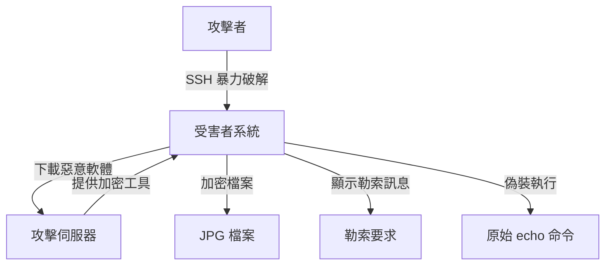

# Ransomware and Malware Attacks - Documentation Index

## 專案概述 (Project Overview)

This project demonstrates comprehensive **Ransomware and Malware attack techniques** including file encryption, SSH brute force attacks, malware deployment, and evasion methods. The implementation showcases how attackers can compromise systems, encrypt victim files, and deploy malicious payloads through various attack vectors.

## 文檔結構 (Documentation Structure)

### 1. 主要文檔 (Main Documentation)
- **[README_DOCUMENTATION.md](./README_DOCUMENTATION.md)** - 專案概述和基本使用說明
- **[RANSOMWARE_ATTACKS_ANALYSIS.md](./RANSOMWARE_ATTACKS_ANALYSIS.md)** - 勒索軟體攻擊詳細分析
- **[MALWARE_TECHNIQUES_ANALYSIS.md](./MALWARE_TECHNIQUES_ANALYSIS.md)** - 惡意軟體技術深度分析

### 2. 原始檔案 (Original Files)
- **[echo.c](./echo.c)** - 勒索軟體主程式 (偽裝成 echo)
- **[crack_attack](./crack_attack)** - SSH 暴力破解腳本
- **[attack_server](./attack_server)** - 攻擊者伺服器
- **[Makefile](./Makefile)** - 編譯設定檔
- **[csc-project3.pdf](./csc-project3.pdf)** - 專案需求文件

## 快速開始 (Quick Start)

### 編譯和設定
```bash
# 編譯所有程式
make all

# 啟動攻擊伺服器
./attack_server <port>

# 執行 SSH 暴力破解
./crack_attack <victim_ip> <attacker_ip> <attacker_port>
```

## 攻擊類型 (Attack Types)

### 1. Ransomware Attack (勒索軟體攻擊)
- **目標**: 加密受害者的檔案並要求贖金
- **實現**: `echo.c` - 偽裝成 echo 命令的勒索軟體
- **影響**: 檔案被加密，系統功能受損

### 2. SSH Brute Force Attack (SSH 暴力破解攻擊)
- **目標**: 通過暴力破解獲得 SSH 存取權限
- **實現**: `crack_attack` - Python 腳本進行密碼破解
- **影響**: 未授權的系統存取

### 3. Malware Deployment (惡意軟體部署)
- **目標**: 在受害系統上部署惡意軟體
- **實現**: `attack_server` - 攻擊者伺服器提供惡意軟體
- **影響**: 系統被植入惡意軟體

## 技術架構 (Technical Architecture)

### 攻擊流程


### 核心組件
1. **Ransomware Module** - 勒索軟體模組
2. **SSH Brute Force Module** - SSH 暴力破解模組
3. **Attack Server Module** - 攻擊伺服器模組
4. **File Encryption Module** - 檔案加密模組
5. **Disguise Module** - 偽裝模組

## 勒索軟體技術分析 (Ransomware Techniques Analysis)

### 加密技術
- **AES 加密**: 使用 AES 演算法加密檔案
- **目標選擇**: 專門針對 JPG 圖片檔案
- **批次處理**: 自動處理目錄中的所有目標檔案
- **檔案替換**: 直接替換原始檔案

### 偽裝技術
- **命令替換**: 偽裝成系統的 echo 命令
- **內嵌原始程式**: 將原始程式壓縮並內嵌
- **動態解壓**: 執行時解壓縮原始程式
- **參數保持**: 保持原始命令的參數

### 部署技術
- **SSH 暴力破解**: 通過暴力破解獲得存取權限
- **自動化部署**: 成功登入後自動部署惡意軟體
- **遠端執行**: 在受害系統上執行惡意軟體
- **清理機制**: 執行後清理攻擊痕跡

## 惡意軟體技術分析 (Malware Techniques Analysis)

### 偽裝技術
- **程式名稱偽裝**: 偽裝成合法的系統命令
- **檔案內嵌**: 內嵌壓縮的原始程式
- **數位簽章**: 使用私鑰簽署惡意軟體
- **功能維持**: 維持原始命令的功能

### 隱藏技術
- **程序隱藏**: 使用 fork 隱藏執行
- **檔案隱藏**: 使用臨時檔案避免檢測
- **網路隱藏**: 使用標準協定模擬正常流量
- **痕跡消除**: 執行後自動清理痕跡

### 逃避檢測技術
- **反分析技術**: 使用動態執行避免靜態分析
- **時間延遲**: 使用隨機延遲避免檢測
- **錯誤處理**: 完善的錯誤處理機制
- **行為模擬**: 模擬正常用戶的行為

## 防護機制 (Defense Mechanisms)

### 勒索軟體防護
1. **檔案備份** - 定期備份重要檔案
2. **檔案監控** - 監控檔案系統變化
3. **權限控制** - 限制檔案存取權限
4. **惡意軟體檢測** - 部署防毒軟體

### SSH 安全防護
1. **強密碼政策** - 使用複雜的密碼
2. **多因子認證** - 啟用 2FA
3. **IP 白名單** - 限制 SSH 存取來源
4. **失敗鎖定** - 實施帳戶鎖定機制

### 一般防護措施
1. **網路分段** - 隔離重要系統
2. **入侵檢測** - 部署 IDS/IPS 系統
3. **安全更新** - 定期更新系統和軟體
4. **用戶教育** - 提高安全意識

## 檢測和回應 (Detection and Response)

### 檢測方法
1. **靜態分析** - 檢測已知的惡意軟體特徵
2. **動態分析** - 監控程式的執行行為
3. **網路監控** - 分析網路流量模式
4. **行為分析** - 檢測異常的行為模式

### 回應措施
1. **隔離感染系統** - 立即斷開網路連接
2. **惡意軟體清除** - 刪除惡意軟體檔案
3. **系統修復** - 修復系統到正常狀態
4. **安全加固** - 加強安全防護措施

## 法律和道德考量 (Legal and Ethical Considerations)

### 合法使用場景
- 網路安全教育和研究
- 授權的滲透測試
- 自己的網路環境測試
- 安全產品開發和測試

### 非法使用場景
- 未經授權的網路攻擊
- 竊取他人資料
- 勒索和敲詐
- 任何惡意目的

### 責任聲明
使用者必須確保：
1. 獲得所有必要的授權
2. 遵守當地法律法規
3. 只用於合法目的
4. 承擔所有相關責任

## 學習目標 (Learning Objectives)

通過此專案，您將學習到：

### 1. 網路安全概念
- 勒索軟體攻擊原理
- 惡意軟體技術
- SSH 安全機制
- 檔案加密技術

### 2. 程式設計技能
- C 語言網路程式設計
- Python 自動化腳本
- 系統程式設計
- 加密演算法應用

### 3. 系統管理技能
- Linux 系統管理
- 網路安全配置
- 檔案權限管理
- 程序監控

### 4. 安全分析技能
- 威脅建模
- 風險評估
- 防護機制設計
- 事件回應

## 進階主題 (Advanced Topics)

### 1. 進階攻擊技術
- 進階持續性威脅 (APT)
- 零日漏洞利用
- 供應鏈攻擊
- 無檔案惡意軟體

### 2. 進階防護技術
- 零信任架構
- 人工智慧防護
- 行為分析
- 威脅情報

### 3. 檢測和回應
- 自動化回應
- 威脅獵殺
- 事件回應流程
- 災難恢復

## 相關資源 (Related Resources)

### 1. 技術文檔
- [NIST Cybersecurity Framework](https://www.nist.gov/cyberframework)
- [OWASP Top 10](https://owasp.org/www-project-top-ten/)
- [MITRE ATT&CK](https://attack.mitre.org/)
- [CIS Controls](https://www.cisecurity.org/controls/)

### 2. 工具和框架
- [Metasploit](https://www.metasploit.com/) - 滲透測試框架
- [Wireshark](https://www.wireshark.org/) - 網路協定分析器
- [YARA](https://yara.readthedocs.io/) - 惡意軟體檢測規則
- [Cuckoo Sandbox](https://cuckoosandbox.org/) - 惡意軟體分析沙箱

### 3. 學習資源
- [Cybrary](https://www.cybrary.it/) - 網路安全課程
- [SANS](https://www.sans.org/) - 安全培訓和認證
- [Coursera](https://www.coursera.org/) - 線上課程
- [edX](https://www.edx.org/) - 大學課程

## 貢獻指南 (Contributing Guidelines)

### 1. 代碼貢獻
- 遵循 C 和 Python 編程規範
- 添加適當的註釋和文檔
- 包含錯誤處理和日誌記錄
- 進行充分的測試

### 2. 文檔貢獻
- 使用清晰的英文和繁體中文
- 提供代碼範例和圖表
- 保持文檔的準確性和時效性
- 遵循 Markdown 格式規範

### 3. 安全考量
- 確保所有貢獻都是合法的
- 不包含惡意代碼或內容
- 遵循負責任的披露原則
- 考慮安全影響

## 版本歷史 (Version History)

### v1.0.0 (2025-01-XX)
- 初始版本發布
- 勒索軟體攻擊功能
- SSH 暴力破解功能
- 惡意軟體部署功能
- 完整的文檔和說明

## 授權條款 (License)

此專案僅供教育和研究目的使用。使用者必須：

1. 獲得所有必要的授權
2. 遵守當地法律法規
3. 只用於合法目的
4. 承擔所有相關責任

## 聯絡資訊 (Contact Information)

如有問題或建議，請通過以下方式聯絡：

- **專案維護者**: [Your Name]
- **電子郵件**: [your.email@example.com]
- **GitHub**: [your-github-username]
- **LinkedIn**: [your-linkedin-profile]

## 免責聲明 (Disclaimer)

本專案僅供教育和研究目的使用。作者不對任何因使用本專案而造成的損害負責。使用者必須：

1. 確保合法使用
2. 獲得適當授權
3. 遵守相關法律
4. 承擔所有責任

使用本專案即表示您同意上述條款。

---

**最後更新**: 2025年1月
**版本**: 1.0.0
**狀態**: 穩定版本
