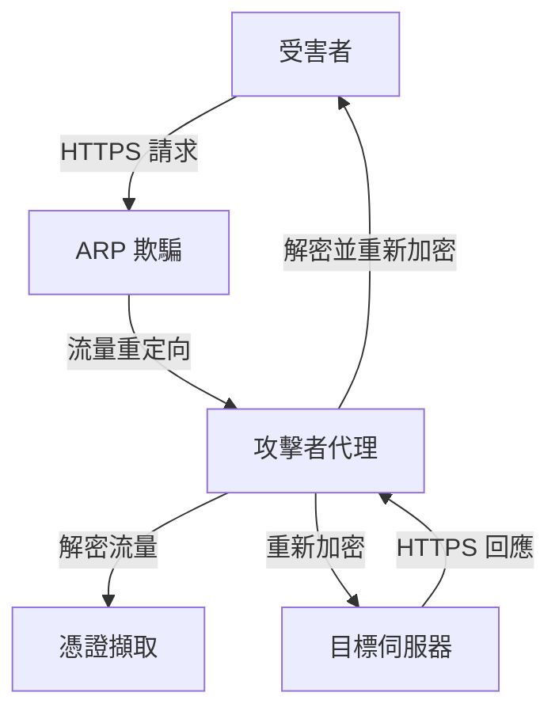
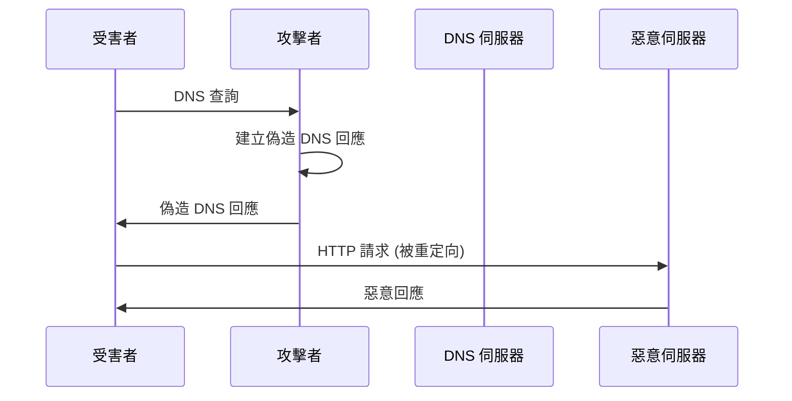
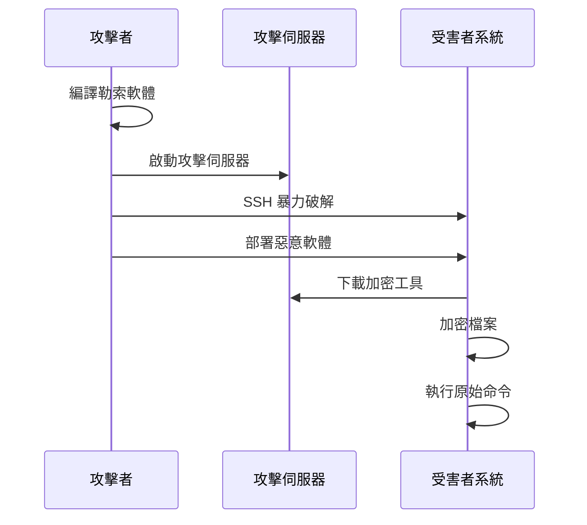

# Computer Security Capstone 2025

## 專案概述 (Project Overview)

本專案是 2025 年電腦安全總整課程的綜合性實作專案，包含四個主要作業，涵蓋現代網路安全的核心攻擊技術和防護機制。每個作業都設計用來深入理解特定類型的安全威脅，並提供實戰經驗來學習如何防護這些攻擊。

## 專案結構 (Project Structure)

```
Computer_Security_Capstone_2025/
├── HW1/                           # TLS 連接劫持攻擊
│   ├── README.md                  # 主要說明文件
│   ├── SCRIPT_ANALYSIS.md         # 腳本技術分析
│   ├── attack.py                  # MITM 攻擊程式
│   ├── setup.sh                   # 攻擊者環境設定
│   ├── victim_setup.sh            # 受害者環境設定
│   ├── arpspoof.sh               # ARP 欺騙腳本
│   └── certificates/              # SSL 證書目錄
├── HW2/                           # MITM 和 Pharming 攻擊
│   ├── README.md                  # 主要說明文件
│   ├── ATTACK_METHODS_ANALYSIS.md # 攻擊方法分析
│   ├── he110_pharm.cpp           # DNS 欺騙攻擊程式
│   ├── icmp_redirect.cpp         # ICMP 重定向攻擊程式
│   └── makefile                   # 編譯設定檔
├── HW3/                           # 勒索軟體和惡意軟體攻擊
│   ├── README.md                  # 主要說明文件
│   ├── MALWARE_TECHNIQUES_ANALYSIS.md # 惡意軟體技術分析
│   ├── echo.c                     # 勒索軟體主程式
│   ├── crack_attack.py            # SSH 暴力破解腳本
│   ├── attack_server.py           # 攻擊者伺服器
│   └── Makefile                   # 編譯設定檔
└── HW4/                           # CTF 漏洞利用挑戰
    ├── README.md                  # 主要說明文件
    ├── VULNERABILITY_ANALYSIS.md  # 漏洞分析文檔
    ├── docker-compose.yaml       # Docker 容器編排
    ├── password_checker/          # 密碼檢查器挑戰
    ├── simple_shell/              # 簡單殼層挑戰
    ├── simple_rop/                # 簡單 ROP 挑戰
    ├── ret2flag/                  # 返回至 Flag 挑戰
    ├── secure_random/             # 安全隨機數挑戰
    ├── simple_rtos/               # 簡單 RTOS 挑戰
    └── hard_rop/                  # 困難 ROP 挑戰
```

## 作業詳細介紹 (Homework Details)

### HW1: TLS 連接劫持攻擊 (TLS Connection Hijacking)

**技術重點**: 中間人攻擊、ARP 欺騙、SSL/TLS 代理

**攻擊流程**:


**學習目標**:
- 理解 ARP 欺騙攻擊原理
- 學習 SSL/TLS 代理技術
- 掌握憑證擷取方法
- 了解證書驗證機制

**難度**: ⭐⭐⭐

### HW2: MITM 和 Pharming 攻擊 (MITM and Pharming Attacks)

**技術重點**: DNS 欺騙、ICMP 重定向、網路協定攻擊

**攻擊流程**:


**學習目標**:
- 掌握 DNS 欺騙技術
- 理解 ICMP 重定向攻擊
- 學習網路流量分析
- 了解 Pharming 攻擊原理

**難度**: ⭐⭐⭐

### HW3: 勒索軟體和惡意軟體攻擊 (Ransomware and Malware Attacks)

**技術重點**: 勒索軟體、SSH 暴力破解、惡意軟體部署

**攻擊流程**:


**學習目標**:
- 理解勒索軟體運作機制
- 學習 SSH 暴力破解技術
- 掌握惡意軟體偽裝方法
- 了解檔案加密技術

**難度**: ⭐⭐⭐⭐

### HW4: CTF 漏洞利用挑戰 (CTF Exploitation Challenges)

**技術重點**: 二進制漏洞利用、ROP 攻擊、密碼學攻擊

**挑戰類型**:
- **Password Checker** (整數溢出) - ⭐
- **Simple Shell** (緩衝區溢出) - ⭐⭐
- **Simple ROP** (返回導向程式設計) - ⭐⭐⭐
- **Ret2Flag** (返回地址覆蓋) - ⭐⭐
- **Secure Random** (密碼學弱點) - ⭐⭐
- **Simple RTOS** (格式化字串) - ⭐⭐⭐
- **Hard ROP** (複雜 ROP 攻擊) - ⭐⭐⭐⭐⭐

**學習目標**:
- 掌握各種漏洞利用技術
- 學習現代防護機制繞過
- 理解記憶體安全問題
- 培養漏洞分析能力

**難度**: ⭐⭐⭐⭐⭐

## 技術技能覆蓋 (Technical Skills Coverage)

### 網路安全技術
- **中間人攻擊**: ARP 欺騙、DNS 欺騙、ICMP 重定向
- **流量分析**: 封包攔截、協定分析、流量重定向
- **加密技術**: SSL/TLS 代理、憑證管理、密碼學攻擊

### 系統安全技術
- **記憶體安全**: 緩衝區溢出、格式化字串、整數溢出
- **權限提升**: 結構體覆蓋、返回地址覆蓋
- **惡意軟體**: 勒索軟體、木馬、後門

### 進階攻擊技術
- **ROP 攻擊**: Gadget 搜尋、ROP 鏈構造、系統調用
- **保護繞過**: ASLR、DEP/NX、Stack Canaries、CFI
- **密碼學攻擊**: 隨機數預測、密碼破解

### 防護機制
- **編譯時保護**: 編譯器安全選項、靜態分析
- **運行時保護**: 動態檢測、行為分析
- **程式設計實踐**: 安全編程、輸入驗證、邊界檢查

## 環境需求 (Environment Requirements)

### 基本需求
- **作業系統**: Linux (Ubuntu 20.04+ 推薦)
- **Python**: 3.8+
- **C/C++**: GCC 編譯器
- **Docker**: 用於 HW4 容器化環境

### 工具需求
- **網路工具**: arpspoof, iptables, tcpdump
- **開發工具**: gdb, objdump, strings
- **漏洞利用工具**: pwntools, ROPgadget
- **分析工具**: Wireshark, AddressSanitizer

### 權限需求
- **Root 權限**: 用於網路攻擊和系統配置
- **Docker 權限**: 用於容器化環境管理

## 快速開始 (Quick Start)

### 1. 環境準備
```bash
# 安裝基本工具
sudo apt update
sudo apt install -y python3 python3-pip gcc gdb docker.io

# 安裝 Python 套件
pip3 install pwntools scapy

# 安裝網路工具
sudo apt install -y dsniff iptables
```

### 2. 選擇作業開始
```bash
# 進入特定作業目錄
cd HW1/  # 或 HW2/, HW3/, HW4/

# 閱讀 README 文件
cat README.md

# 按照指示進行設定和執行
```

### 3. 學習建議
1. **先閱讀 README**: 了解作業目標和技術背景
2. **查看分析文檔**: 深入理解技術細節
3. **實作練習**: 按照步驟進行實際操作
4. **思考防護**: 學習如何防護這些攻擊

## 安全聲明 (Security Disclaimer)

⚠️ **重要警告**: 本專案僅供教育和學習目的使用。所有攻擊技術和漏洞利用方法都應該在合法的環境中進行測試，不得用於任何惡意目的。

### 合法使用場景
- 網路安全教育和研究
- 授權的滲透測試
- 自己的網路環境測試
- 安全產品開發和測試

### 非法使用場景
- 未經授權的網路攻擊
- 竊取他人資料或憑證
- 任何惡意目的
- 違反當地法律法規的行為

## 學習目標 (Learning Objectives)

通過完成這些作業，學習者將能夠：

### 1. 技術技能
- 掌握現代網路安全攻擊技術
- 理解各種漏洞類型和利用方法
- 學習防護機制設計和實現
- 培養安全程式設計思維

### 2. 實戰經驗
- 在實際環境中應用安全知識
- 進行漏洞分析和利用
- 設計和實現防護措施
- 進行安全測試和評估

### 3. 安全意識
- 提高網路安全意識
- 理解攻擊者的思維模式
- 培養防護者的技能
- 建立安全最佳實踐

## 貢獻指南 (Contributing Guidelines)

### 代碼貢獻
- 遵循現有的程式設計規範
- 添加適當的註釋和文檔
- 包含錯誤處理和日誌記錄
- 進行充分的測試

### 文檔貢獻
- 使用清晰的英文和繁體中文
- 提供代碼範例和圖表
- 保持文檔的準確性和時效性
- 遵循 Markdown 格式規範

### 安全考量
- 確保所有貢獻都是合法的
- 不包含惡意代碼或內容
- 遵循負責任的披露原則
- 考慮安全影響

## 聯絡資訊 (Contact Information)

如有問題或建議，請通過適當的渠道聯絡：

- **課程**: Computer Security Capstone 2025
- **機構**: [Your Institution Name]
- **學期**: 2025 Spring

## 授權條款 (License)

本專案僅供教育和研究目的使用。使用者必須：

1. 獲得所有必要的授權
2. 遵守當地法律法規
3. 只用於合法目的
4. 承擔所有相關責任

---

**最後更新**: 2025年1月  
**版本**: 1.0.0  
**狀態**: 穩定版本

*本專案提供了完整的網路安全學習路徑，從基礎的網路攻擊到進階的漏洞利用技術，幫助學習者建立全面的安全知識體系。*